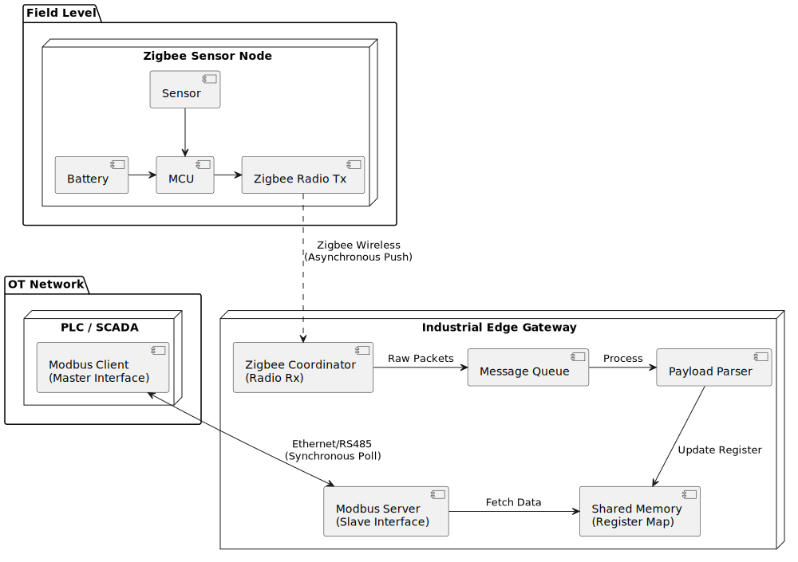
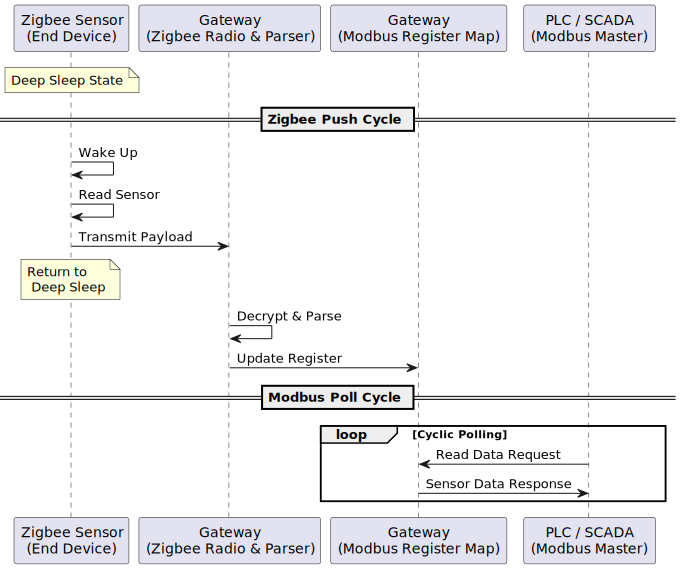

# Work Plan: Zigbee-Modbus Gateway

## 1. Architecture and Requirements

The system acts as a bridge between a wireless Zigbee sensor network and a control system via Modbus.

* **End Device:** Battery-powered temperature sensor. Operates primarily in **Deep Sleep** mode. It wakes up at regular intervals to read data and transmit the payload (**Push**).
* **Gateway:** Asynchronously captures packets from the Zigbee network, decrypts them, and extracts useful information. Data is stored in **Shared Memory (Register Map)**.
* **Modbus Interface:** The Gateway runs a **Modbus TCP Server** that allows polling by an external client (SCADA/PLC) of the registers stored in the shared memory.
* **CI/CD:** Development includes an automated pipeline for building and unit testing, focusing on validating parsing logic and concurrent register access.

## 2. Diagrams

### 2.1 Data Flow

### 2.2 System Topology

## 3. Development Steps

### Phase 1: Setup & CI/CD

* Select Gateway and End-device hardware.
* Configure basic **GitHub Actions** CI/CD pipeline.
* Integrate linter and **Unit Testing** framework.

### Phase 2: End-Device (Zigbee Node)

* Interface sensors with the microcontroller.
* Implement **Deep Sleep / Wake Up** routines.
* Establish Zigbee network connection and define payload format.
* Implement cyclic packet transmission.

### Phase 3: Gateway & Parser

* Configure Gateway as a **Zigbee Coordinator**.
* Implement a **Message Queue** for asynchronous message handling.
* Develop the payload parser and write Unit Tests in the CI/CD pipeline to validate decoding.

### Phase 4: Modbus Server & Shared Memory

* Implement **Shared Memory** with concurrent access protection (**mutex**).
* Set up the Modbus server on the designated port.
* Integrate automated logic tests for the flow: *Memory Write -> Modbus Response Validation*.

### Phase 5: E2E Integration (End-to-End)

* Full hardware/software system execution.
* Test register polling using an external Modbus client.
